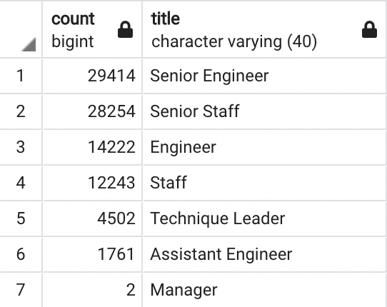

# Pewlett-Hackard-Analysis

# Overview: 
The purpose of this analysis is to determine the number of retiring employees per title and identify employees who are eligible to participate in a mentorship program. This will help managers prepare for the "silver tsunami" as employees reach retirement age. 

### Resources: 
[Employee_Database_challenge.sql](Queries/Employee_Database_challenge.sql),
[retirement_titles.csv](Data/retirement_titles.csv), 
[unique_titles.csv](Data/unique_titles.csv),
[retiring_titles.csv](Data/retiring_titles.csv), 
[mentorship_eligibilty.csv](Data/mentorship_eligibilty.csv)

### Software: 
pdAdmin 4 (version 5) 

## Results:
-	From our analysis, we found that there are 90,398 employees who are about to be eligible for retirement (i.e., born between 1952 and 1955) 
-	The employee title with the highest number of employees about to be eligible for retirement is Senior Engineer with 29,414 employees. 
-	The employee title with the lowest number of employees about to be eligible for retirement is Manager with 2 employees. (Full list of employee titles about to be eligible for retirement is below.)
-	The number of current employees who are eligible for the mentorship program is 1,549 (i.e., born in 1965)

 
## Summary:
- How many roles will need to be filled as the "silver tsunami" begins to make an impact? 90,398 roles will need to be filled as the "silver tsunami" (retirement eligible employees) begins to make an impact. 
- Are there enough qualified, retirement-ready employees in the departments to mentor the next generation of Pewlett Hackard employees? Yes, there are enough retirement-ready employees in the departments to mentor the next generation of Pewlett Hackard employees.
- Another table that would provide more insight into the upcoming "silver tsunami" would be to see how many employees remain employees after they are eligible for retirement. 
- A helpful query would be to see how many employees would qualify for the mentorship program if the search was expanded to include employees born between 1962 and 1965.
